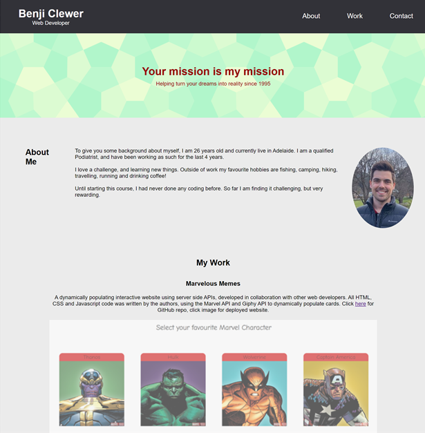
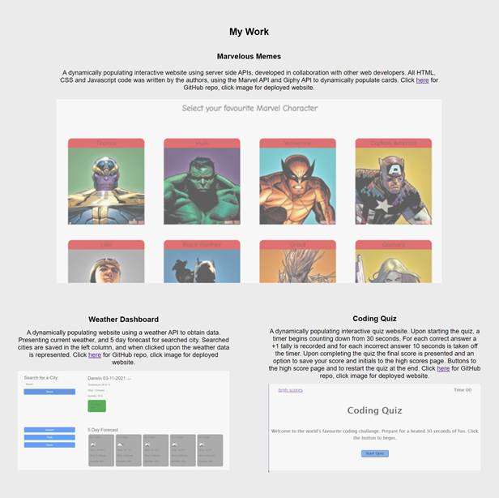
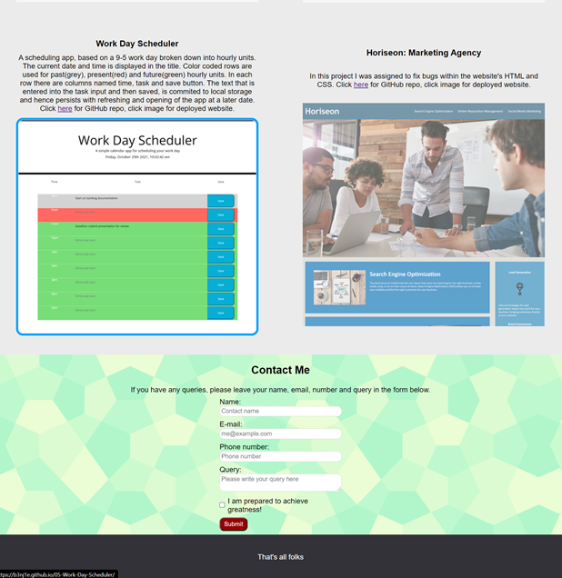
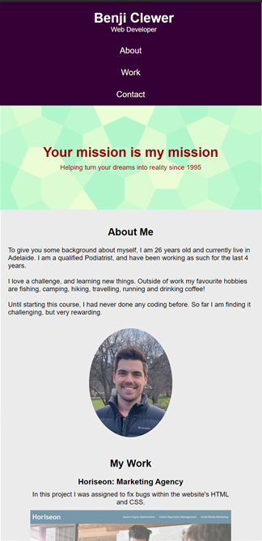
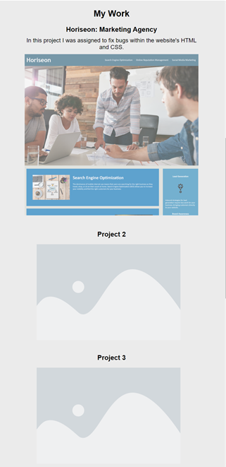
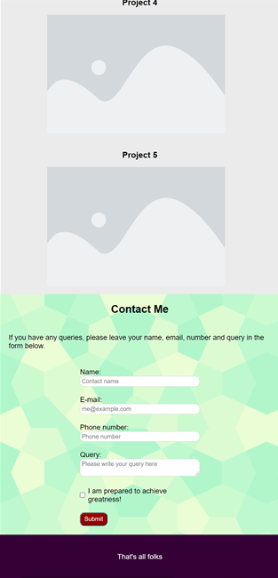

# 02 Homework Portfolio

Thank you for reviewing my project. I will display my work using screenshot and descriptions for both media screen size > 786px and < 786px.

## Media Screen Width > 786px:



```
In screenshot 1:

Nav-bar:
-title to left of header
-nav buttons to right of header
-on cursor hover, nav button text color changes

Acceptance criteria met:
-About, work and contact nav buttons
-When a nav button is clicked, the screen moves to the correlating body section.
-Developer's name as heading of website
-About me section includes some personal info, personal photo.
```





```
In screenshot 2 & 3:

Work section:
-when cursor hovers, opacity is removed, blue border appears around work card

Contact section:
-form for user to fill in their details and query

Acceptance criteria:
-first work card displays bigger than other work cards
-when clicked, the first work card opens a new tab and goes to the relevant website
```

## Media Screen Width < 786px:



```
Screenshot 4:
-header color changes when media screen < 786px
-nav bar changes from row to column
-about me section changes from row to column

Acceptance criteria:
-website layout is responsive to media screen size

```





```
Screenshot 5 & 6:
-work cards automatically resize to screen width
-word cards change from row to column
-footer changes to same color as header
-website layout is generally responsive to media screen size change

```

To access github repository please click [here](https://github.com/B3nj1e/02-Homework-Portfolio-Clewer). To access webpage please click [here](https://b3nj1e.github.io/02-Homework-Portfolio-Clewer/). 